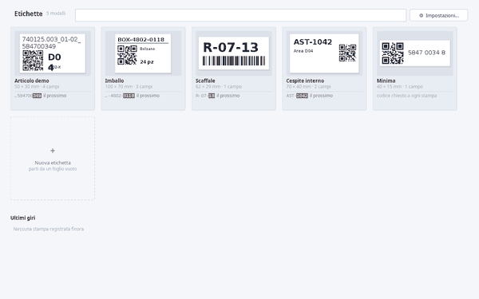
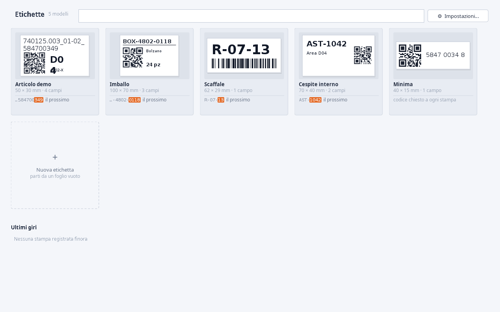
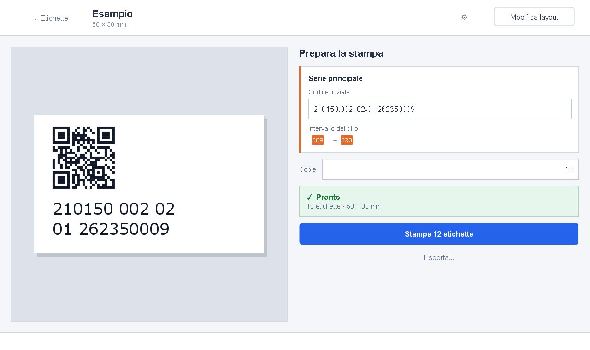

<div align="center">

# EtichetteCustom

A standalone Java/Swing tool for designing and printing serialized labels with
readable text, QR codes and Code 128 barcodes.

[](https://github.com/importriri/EtichetteCustom/actions/workflows/tests.yml)
[](https://github.com/importriri/EtichetteCustom/actions/workflows/lint.yml)



</div>

## Why

Production labels need more than a drawing surface. A sequence must not advance
before a successful print, readable text must stay consistent with encoded data,
and preview and print must share the same geometry.

EtichetteCustom keeps those rules in one small application. It runs as a
Java 8-compatible standalone JAR with no runtime dependencies.

## Workflow

**Gallery** — open a saved label or create one. A fresh data directory starts
with one editable example.

**Editor** — select, drag and resize elements directly on the label. The
inspector shows only controls relevant to the current selection; precise
measurements and technical QR options stay available when needed.

**Print** — enter only values needed for the current run, check the outgoing
range and open the operating-system print dialog. Cancelling does not consume
sequence numbers.

A source value can feed QR, Code 128 and readable text at the same time. Readable
text can hide separators, wrap at logical boundaries, or expose selected logical
parts without changing the exact encoded source.

## Reliability

- Preview, editor, PNG, PDF and Java printing share one renderer.
- QR and barcode payloads always use the exact source value.
- Sequential ranges are validated before printing.
- Counters advance only after a successful print job.
- Layout state is persisted after printing and each run is logged.
- Older v3 and v4 label files remain readable.
- UI regressions are exercised on Linux and native Windows at several scales.

## Screenshots

| Gallery | Editor | Print |
|---|---|---|
|  |  |  |

The screenshots, demo and bundled example use synthetic data.

## Project layout

```text
src/app/modello/      label data, content sources and sequences
src/app/render/       shared drawing and text layout
src/app/codice/       QR and Code 128 encoders
src/app/archivio/     persistence and print history
src/app/stampa/       physical printing
src/app/esporta/      PNG, PDF and SVG export
src/app/ui/           gallery, editor, print flow and dialogs
src/app/stile/        Swing design system
prove/                regression and graphical audit programs
```

See [`docs/ARCHITECTURE.md`](docs/ARCHITECTURE.md) for the internal boundaries.

## Verify

Requirements: JDK 8 or newer. The full Linux display audit also uses Xvfb.

```bash
./verify.sh
java -jar dist/EtichetteCustom.jar
```

`verify.sh` compiles with warnings as errors, runs model/rendering regressions,
executes graphical audits when a display is available, validates repository
media and builds the standalone JAR. GitHub Actions adds a native Windows UI
matrix.

## Manuals

- [Italiano](docs/MANUAL.it.md)
- [English](docs/MANUAL.en.md)

The same manuals are available from the application settings.

## License

MIT
