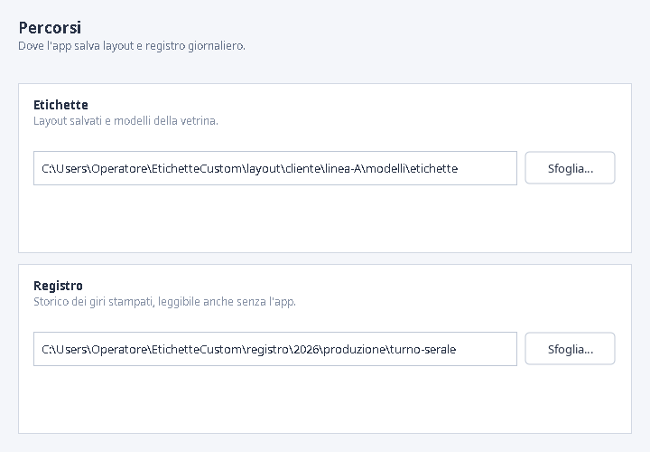

<div align="center">

# Etichette Custom

A standalone Java/Swing application for designing, preparing, exporting and
printing serialized labels with text, QR codes and Code 128 barcodes.

[](https://github.com/importriri/etichette-custom/actions/workflows/tests.yml)
[](https://github.com/importriri/etichette-custom/actions/workflows/lint.yml)


</div>

## Workflow

Etichette Custom separates routine printing from layout editing.

**Gallery → Operator mode → Print** is the normal production path. A label is
chosen from its real preview, run-time values and copy count are entered in a
protected screen, and the application shows the exact outgoing sequences before
opening the system print dialog.

**Gallery → Edit layout** opens the design workspace. Text, code, QR, barcode
and line elements can be placed in millimetres, moved, rotated and linked to
shared or independent data sources.

| Gallery | Operator mode | Layout editor |
|---|---|---|
|  |  |  |

## Data model

Visual elements and data are separate concepts.

Two elements can read the same data source—for example a QR code and its human
readable text. In that case the operator enters the value once and the print
screen shows one logical data card. An element can also be made independent and
receive its own value or sequence.

Each data source can be:

- **fixed** — stored with the layout;
- **sequential** — its own independent numeric window and counter;
- **requested at print time** — entered for each run.

A single label can therefore contain several independent sequences. Every
sequence is validated before printing and refuses a run that would overflow its
configured numeric window.

## Printing guarantees

The application follows a deliberately conservative transaction order:

1. validate the complete run;
2. open the operating-system print dialog;
3. print every page;
4. only after a successful print, consume sequence numbers;
5. persist the updated layout and append the daily log.

Cancelling the print dialog does **not** consume a number.

The page passed to Java printing has the physical label size and zero margins.
The print queue itself remains the one selected by the operating system.

## One renderer

Preview, editor canvas, PNG, PDF and Java printing all use the same drawing
code. SVG follows the same millimetre geometry and rotation rules.

This keeps element position, wrapping, QR modules, barcode bars and rotations
consistent instead of maintaining separate layouts for screen and output.

## Operator UI

The interface is intentionally light and operator-first:

- real rendered previews in the gallery;
- protected print-preparation mode;
- semantic data names instead of storage identifiers;
- exact sequence ranges before printing;
- QR/barcode readability warnings in plain language;
- undo and redo in the editor;
- unified settings for paths, printer metadata, manuals and project info;
- built-in Italian and English operator manuals;
- UI scaling checks for common enlarged-font profiles.

The bundled layouts and screenshots use synthetic example data. Production
identifiers are not required in the source tree.

### Settings

Paths, printer metadata, manuals and project information live in one settings
dialog. Long paths remain readable and the built-in manual follows the same UI
scaling as the rest of the application.



## Export

| Output | Behaviour |
|---|---|
| Print | one physical-size page per label |
| PDF | one file containing the complete run |
| PNG | one raster image per label at the selected resolution |
| SVG | vector output with physical dimensions expressed in millimetres |

## Build and verify

Requirements: JDK 8 or newer. The full Linux UI audit also uses Xvfb.

```bash
./verify.sh
java -jar dist/EtichetteCustom.jar
```

`verify.sh` compiles for Java 8 with warnings as errors, executes the core and
behaviour regressions, runs the Swing layout audits when Xvfb is available,
generates QR/barcode samples and builds the standalone JAR.

When `ETICHETTE_PRIVATE_DENYLIST` is configured in CI, the repository also runs
a fail-closed scan for private identifiers before verification.

## Source layout

```text
src/app/codice/       QR and Code 128 encoders
src/app/modello/      labels, data fields, sequences and settings
src/app/render/       shared drawing and geometry
src/app/archivio/     layout storage and daily log
src/app/stampa/       print job
src/app/esporta/      PNG, PDF and SVG export
src/app/stile/        UI design system
src/app/ui/           gallery, operator mode, editor and dialogs
prove/                plain-JDK regression and UI audit programs
```

See [Architecture](docs/ARCHITECTURE.md) for the invariants behind the design.

## Manuals

- [Manuale operatore — Italiano](docs/MANUAL.it.md)
- [Operator manual — English](docs/MANUAL.en.md)

The same workflow is also documented inside the JAR under **Impostazioni →
Manuale**.

## License

MIT
